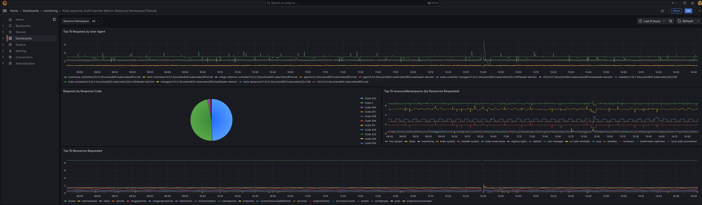

# Kube apiserver audit exporter

kube-apiserver-audit-exporter is a tool that parses your Kubernetes apiserver's audit log and exposes detailed audit events as Prometheus metrics.

## Installation

<!-- TODO: Add helm chart -->

### Manifests

It is recommended to deploy this exporter as `DaemonSet`:

- Exporter should be launched on all master nodes in a cluster
    - Specify affinity to skip scheduling on worker nodes
    - Specify tolerations to allow scheduling on control plane nodes
- Audit log should be mounted inside container via `hostPath`

```yaml
apiVersion: apps/v1
kind: DaemonSet
metadata:
  name: kube-apiserver-audit-exporter
  namespace: monitoring
  labels:
    app.kubernetes.io/name: kube-apiserver-audit-exporter
spec:
  selector:
    matchLabels:
      app.kubernetes.io/name: kube-apiserver-audit-exporter
  template:
    metadata:
      labels:
        app.kubernetes.io/name: kube-apiserver-audit-exporter
    spec:
      affinity: # Affinity is required, we want to launch exporter on control plane nodes only, exporter does not make sense on workers
        nodeAffinity:
          requiredDuringSchedulingIgnoredDuringExecution:
            nodeSelectorTerms:
              - matchExpressions:
                  - key: node-role.kubernetes.io/control-plane
                    operator: Exists
      tolerations: # Tolerations are required as well to allow scheduling on control plane nodes
        - key: "node-role.kubernetes.io/control-plane"
          operator: "Exists"
          effect: "NoSchedule"
      containers:
        - name: exporter
          image: "ghcr.io/tfk70/kube-apiserver-audit-exporter:0.0.1"
          imagePullPolicy: IfNotPresent
          args:
            - -a
            - /var/log/audit/kube/kube-apiserver.log # Specify path where audit log is being mounted
          ports:
            - containerPort: 8080
              name: metrics
              protocol: TCP
          volumeMounts:
            - mountPath: /var/log/audit/kube # Specify container mount path for audit log
              name: audit
      volumes:
        - hostPath:
            path: /var/log/audit/kube # Path to audit log on control plane node (this value may vary)
          name: audit
```

## Collect metrics

This configuration may vary depending on what metrics collector you are using. Here is an example of collecting metrics from this exporter using victoria metrics operator's custom resources:

### Service

Metrics will be scraped through endpoints. Endpoints won't be created unil you create a service for your workloads:

```yaml
apiVersion: v1
kind: Service
metadata:
  name: kube-apiserver-audit-exporter
  namespace: monitoring
  labels:
    app.kubernetes.io/name: kube-apiserver-audit-exporter
spec:
  selector:
    app.kubernetes.io/name: kube-apiserver-audit-exporter
  ports:
  - name: metrics
    port: 8080
    protocol: TCP
    targetPort: metrics
```

### VMServiceScrape

```yaml
apiVersion: operator.victoriametrics.com/v1beta1
kind: VMServiceScrape
metadata:
  name: kube-apiserver-audit-exporter
  namespace: monitoring
spec:
  selector:
    matchLabels:
      app.kubernetes.io/name: kube-apiserver-audit-exporter
  endpoints:
  - port: metrics
    path: /metrics
  namespaceSelector:
    matchNames:
      - monitoring
```

## Reference

```bash
NAME:
   kube-apiserver-audit-exporter - Export kube-apiserver audit logs data as prometheus metrics

USAGE:
   kube-apiserver-audit-exporter [global options]

VERSION:
   dev

GLOBAL OPTIONS:
   --debug                             Enable debug logging (default: false) [$KUBE_APISERVER_AUDIT_EXPORTER_DEBUG]
   --bind-port int, -p int             Bind port (default: 8080) [$KUBE_APISERVER_AUDIT_EXPORTER_BIND_PORT]
   --audit-log-path string, -a string  Audit log path (default: "/var/log/kubernetes/audit.log") [$KUBE_APISERVER_AUDIT_EXPORTER_AUDIT_LOG_PATH]
   --help, -h                          show help
   --version, -v                       print the version

COPYRIGHT:
   (c) 2025 TFK70
```

## Provided metrics

This exporter provides only 1 metric: `apiserver_requests`

`apiserver_requests{resource="",resourceName="",resourceNamespace="",resourceApiGroup="",resourceApiVersion="",verb="",username="",userAgent="",responseCode=""} <requests_amount>`

## Grafana dashboard

This repository provides [pre-configured grafana dashboard](https://github.com/TFK70/kube-apiserver-audit-exporter/blob/master/dashboards/kube-apiserver-audit-exporter.json) for this exporter as well.

### Screenshot



